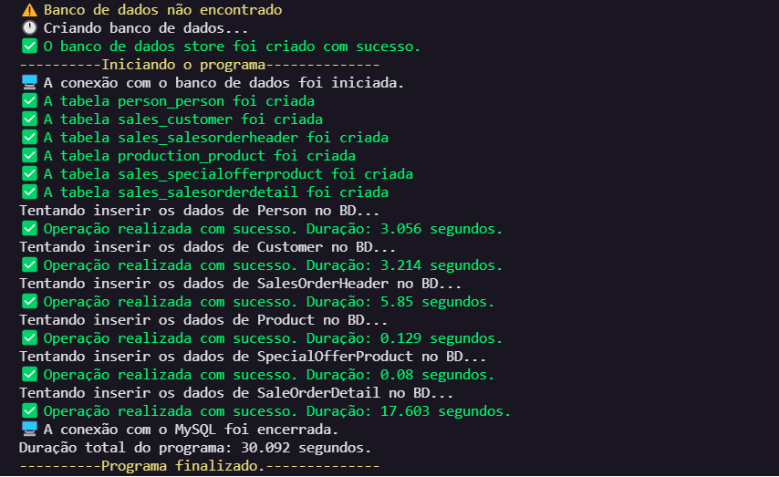
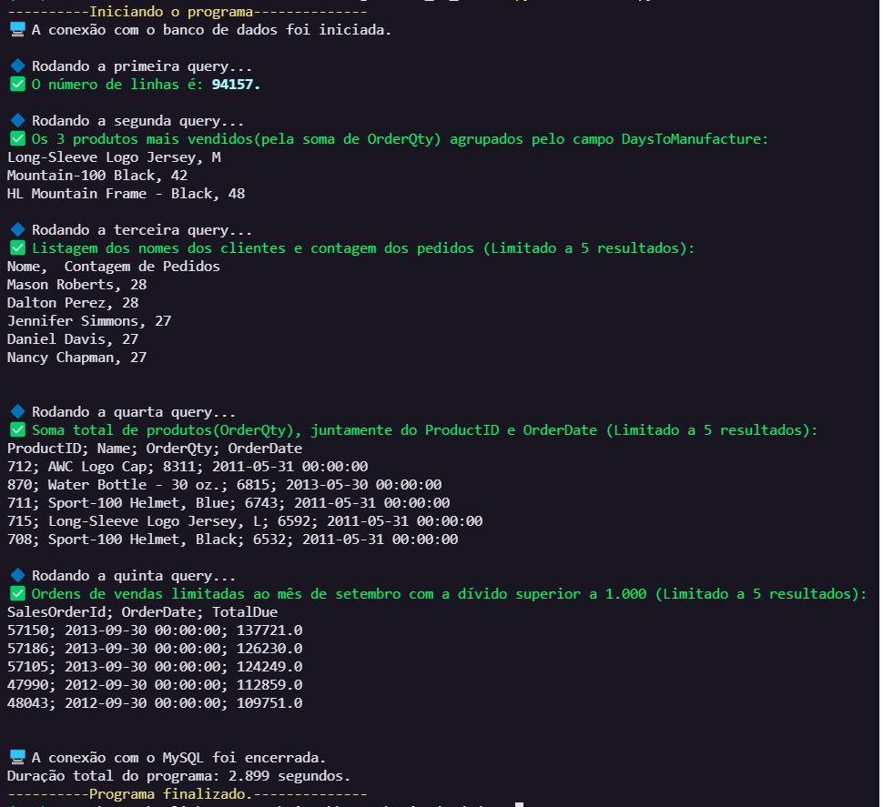

# README

<p align="center">
    <a href="#tecnologias">Tecnologias</a>
    <a href="#demonstracao">Demonstração</a>
    <a href="#instalacao">Instalação</a>
</p>

# Tecnologias
<p>O projeto foi construído utilizando as seguintes tecnologias:</p>
<ul>
    <li>Python</li>
    <li>MySQL</li>
</ul>

# Demonstracao
<h1 align="center">
    Criação das Tabelas e processo de ETL
    
    Análise dos dados
    
    
</h1>


# Instalacao
Certifique-se de possuir algum servidor de MySQL, recomendo o [MySQLWorkbench](https://dev.mysql.com/downloads/workbench/).
```bash
# Clone este repositório
$ git clone <https://github.com/welistonbelles/processo-etl>

# Acesse a pasta do projeto no terminal/cmd
$ cd processo-etl

# Instale as dependências
$ pip install -r requirements.txt
```
### 🔧 Configuracao
```python
# Abra o arquivo main.py, configure o nome da tabela e os dados de acesso ao banco de dados
database_name = "store"

def main():
    try:
        con = mysql.connector.connect(
            host="localhost",
            database=database_name,
            user="root",
            password=""
        )

# Após configurar o acesso com seu banco de dados, podemos começar a rodar as scripts.

# Criação do banco de dados/processo de ETL
python main.py

# Caso precise deletar os dados das tabelas, pode utilizar o seguinte comando
python drop.py

# Por fim, o processo de análise de dados
# OBS: Essa análise já é feita ao executar o arquivo main.py, porém caso queira fazer ela de forma separada em algum momento, poderá utilizar esse comando:
python analise.py
```